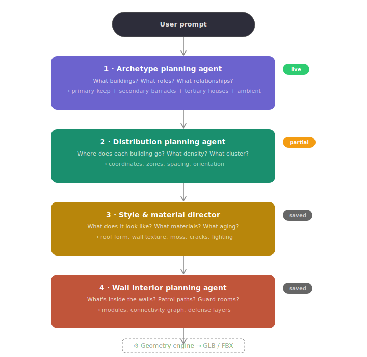
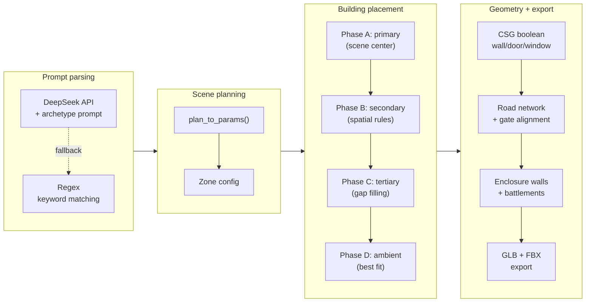
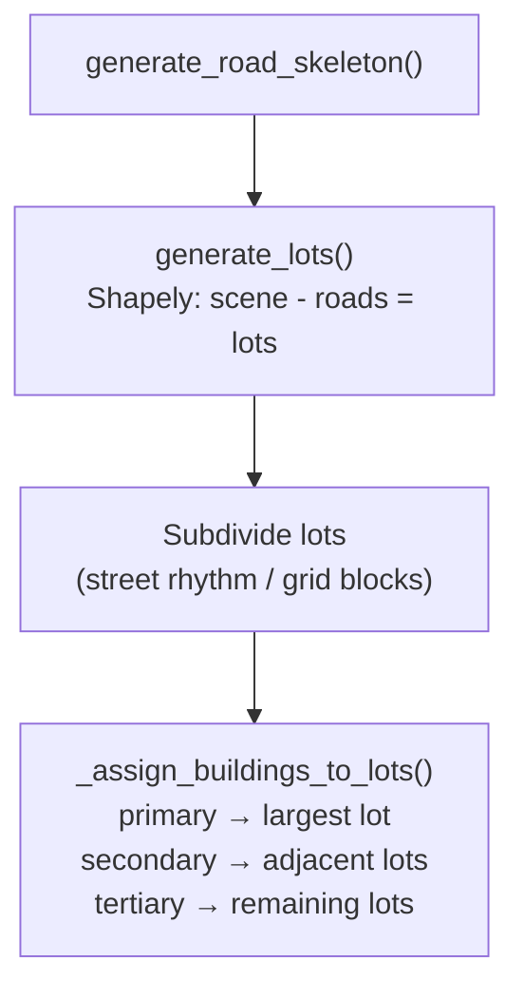
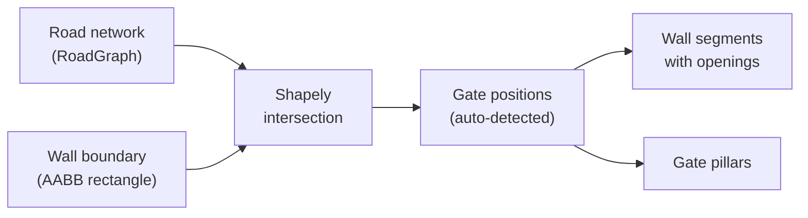

# LevelSmith

**AI-driven procedural level generation for game development.**

LevelSmith transforms natural language prompts into fully realized 3D building layouts — exportable to UE5 as FBX/GLB — powered by a multi-agent LLM pipeline and a trained neural style model.


---

## Architecture overview

The system is built around four specialized AI agents, each responsible for one aspect of scene generation. A user's text prompt flows through the agents in sequence, with each one outputting structured JSON that the next agent (or the geometry engine) consumes.

<p align="center">
  
</p>

### Agent responsibilities

| Agent | Question it answers | Input | Output | Status |
|-------|-------------------|-------|--------|--------|
| **Archetype planning** | What buildings? What roles? What relationships? | User prompt | Building roster, spatial relationships, enclosure, atmosphere | ✅ Live |
| **Distribution planning** | Where does each building go? What density? | Building roster | Coordinates, zones, clusters, orientations | ✅ Partial |
| **Style & material director** | What does it look like? What materials? What aging? | Scene description | Geometry grammar, material grammar, aging rules, lighting | 📄 Designed |
| **Wall interior planning** | What's inside the walls? Patrol paths? Guard rooms? | Wall segment attributes | Modules, connectivity graph, defense layers | 📄 Designed |

---

## Prompt → 3D pipeline



---

## Building styles

LevelSmith supports 20 architectural styles organized into 7 base families, each mapping to a 23-dimensional parameter vector controlling geometry, decoration, and complexity.

| Family | Base style | Variants | Representative features |
|--------|-----------|----------|------------------------|
| Medieval | `medieval` | `medieval_chapel`, `medieval_keep` | Stone walls, battlements, arched windows |
| Modern | `modern` | `modern_loft`, `modern_villa` | Flat roofs, large windows, clean geometry |
| Industrial | `industrial` | `industrial_workshop`, `industrial_powerplant` | Simple geometry, high simple_ratio |
| Fantasy | `fantasy` | `fantasy_dungeon`, `fantasy_palace` | Ornate columns, arched doors, varied roofs |
| Horror | `horror` | `horror_asylum`, `horror_crypt` | Dense detail, high complexity, dark palette |
| Japanese | `japanese` | `japanese_temple`, `japanese_machiya` | Curved eaves, hip roofs, moderate density |
| Desert | `desert` | `desert_palace` | Flat/dome roofs, thick walls, low windows |

### 23 output parameters

| Group | Count | Parameters |
|-------|-------|-----------|
| Structural | 10 | `height_range_min/max`, `wall_thickness`, `floor_thickness`, `door_width/height`, `win_width/height`, `win_density`, `subdivision` |
| Visual | 10 | `roof_type`, `roof_pitch`, `wall_color_r/g/b`, `has_battlements`, `has_arch`, `eave_overhang`, `column_count`, `window_shape` |
| Mesh geometry | 3 | `mesh_complexity`, `detail_density`, `simple_ratio` |

---

## Layout system

### The road-lot architecture

Street and grid layouts use a **lot-based placement system** where roads are generated first, then Shapely polygon subtraction divides the scene into buildable lots. Buildings are constrained inside lots, making road-building overlap physically impossible.



Organic and random layouts use a different approach — buildings are placed first along Bézier curves or random road skeletons, and roads are generated afterward to connect them. This reflects how real organic settlements develop, where paths emerge between existing structures.

### Five layout types

| Layout | Road generation | Building placement | Best for |
|--------|----------------|-------------------|----------|
| `street` | Single central axis → lot subdivision with rhythm | Constrained to lots, variable widths 8-18m | `modern_loft`, `japanese_machiya` |
| `grid` | Orthogonal network → block subdivision | Constrained to grid blocks, ≤4 buildings per block | `modern`, `industrial` |
| `plaza` | Ring road around central square | Phase A-D role-based placement | `desert`, `fantasy_palace` |
| `organic` | Bézier curves from center anchor | Along-road sampling with jitter | `medieval`, `japanese`, `fantasy` |
| `random` | Random road skeleton | Along-road + road-retry fallback | `horror` series |

### Street rhythm system

Real streets have visual rhythm — not uniform repetition. The lot subdivision system generates lots with intentional variation to create a sense of life and organic growth.

| Parameter | Range | Purpose |
|-----------|-------|---------|
| Lot width | 8–18m (random per lot) | Prevents uniform "copy-paste" appearance |
| Setback | 1–4m (random per lot) | Some buildings hug the road, others retreat |
| Fill ratio | 0.5–0.85 | Controls how much of the lot the building occupies |
| Ambient slots | Every 3–5 lots | Inserts wells, market stalls, or other small elements |
| Side independence | Each side generates its own rhythm | Left and right sides of the street are never mirrored |

---

## Development journey

This section documents the key problems encountered during development, how they were diagnosed, and the solutions applied. These notes are intended to help contributors understand why the system works the way it does.

### Problem 1: Road system chaos (v1 → v2 rewrite)

**What went wrong.** The original road system had three competing door-orientation systems (`slot.yaw_deg`, `corridor_door_yaw`, and `orient_doors_to_roads`) that would override each other unpredictably. Each of the five layout types had its own completely independent road generation logic with no shared abstraction. The generation order was inconsistent — sometimes roads were generated before buildings, sometimes after.

**How we diagnosed it.** We mapped out every code path that touched door orientation and found three independent systems writing to the same field. We traced the generation order and found that it varied by layout type, creating inconsistent results.

**How we fixed it.** We established a strict generation order that cannot be violated: buildings → road network → door orientation → corridor connections. We introduced the `RoadGraph` data structure as a unified interface for all layout types. Door orientation was consolidated into a single source of truth: the access edge direction from the road graph. The road system was split into two categories — rule-based layouts (street/grid) and free-form layouts (plaza/random/organic) — with shared interfaces but type-specific algorithms. We also introduced the cluster concept, where roads serve clusters of buildings rather than individual structures, creating a cleaner separation of concerns.

### Problem 2: Gate-road misalignment

**What went wrong.** City gates were hardcoded at the front wall center (`z = inset`, `x = area_w / 2`) with a fixed 6m width, completely ignoring where roads actually went. The main road in street mode ran along `z = area_d / 2`, which meant the gate and the road were on different walls of the enclosure and never intersected. Walking through the gate led to no road.

**How we diagnosed it.** We generated a diagnostic report listing every wall and gate function, their positions, and their inputs. The report revealed that `_make_perimeter_wall()` had zero awareness of the road network — it never received road data as an input. We also discovered that road mesh geometry extended from `x = -2` to `x = area_w + 2`, physically passing through the wall geometry.

**How we fixed it.** We changed the gate positioning from hardcoded to road-derived. The wall generation function now receives the road network and uses Shapely to compute intersection points between road segments and the wall boundary rectangle. Gates are placed at these intersection points, with a width of `max(road_width + 2m, 6m)`. If two intersection points on the same wall are less than 10m apart, they merge into a single wider gate. Road endpoints are clamped to the wall interior so road mesh no longer punches through walls. The result: gates and roads always align, with 0.00m distance between gate centers and road endpoints in our verification tests.

### Problem 3: mesh_complexity parameters unreachable

**What went wrong.** After integrating three new mesh geometry parameters (mesh_complexity, detail_density, simple_ratio) from Witcher 3 data, we ran a diagnostic and found four issues. The `build_model()` factory function still defaulted to `output_dim=20` instead of 23. The parameter export function omitted the three new values. The `mesh_complexity > 0.7` threshold that triggers arch and column decoration was unreachable — all 20 styles had base values between 0.12 and 0.64, so the code path never fired. And a comment claimed "10 new parameters" when the actual count was 13.

**How we diagnosed it.** We generated a structured diagnostic report checking each file for consistency: parameter counts in the registry, default values in the model, threshold values in the generator, and documentation accuracy. The report flagged each issue with severity levels and exact line numbers.

**How we fixed it.** We updated the `build_model()` default to 23, added the three parameters to the export function, replaced the binary threshold (`> 0.7`) with a progressive scaling system (`int(mesh_complexity * 4)` for columns, `> 0.5` for arches), and corrected the documentation. The progressive system means that a style with `mesh_complexity = 0.5` gets 2 columns, while `mesh_complexity = 0.64` (medieval_keep) gets 2-3 columns — a much more natural distribution than the previous all-or-nothing gate.

### Problem 4: Organic/random layouts felt artificial

**What went wrong.** Buildings in organic and random layouts had a distinctly "AI-generated" look due to six specific patterns. Fixed sampling intervals (10m for random, 8m for organic) created equal-spacing patterns along roads. Strict left-right alternation (`side = 1 if i % 2 == 0 else -1`) produced a symmetrical "fishbone" pattern. The grid-scan fallback for placing remaining buildings created visible grid artifacts. All buildings were the same size regardless of their role in the settlement. Random layout door orientations were quantized to 90° increments. And there was no density variation between the center and edges of the settlement.

**How we diagnosed it.** We extracted every placement function and mapped its parameters against what real organic settlements look like. We identified six specific anti-patterns that needed independent fixes.

**How we fixed it.** Each fix targeted one anti-pattern. Interval jitter multiplies the base spacing by a random factor between 0.7 and 1.3 for each sample point independently. Side alternation uses 70/30 probability instead of strict alternation, with ±15° angular jitter on the perpendicular offset. The grid-scan fallback was replaced with a road-retry system that samples at wider offsets (12-20m) with ±23° jitter. Building sizes now follow a role hierarchy (anchor > sub_anchor > normal > filler). Door orientations in random mode dropped the 90° quantization and added ±8° jitter. A zone density gradient function returns 1.0 at the scene center and falls linearly to 0.6 at edges, making centers denser and peripheries sparser.

### Problem 5: Buildings placed on roads (archetype mode)

**What went wrong.** When the archetype agent pipeline was introduced, it created a fundamental decoupling between building placement and road generation. The original layout functions (like `layout_street()`) placed buildings relative to known road positions, so overlap was impossible by construction. But `_archetype_placement()` placed buildings by role hierarchy and spatial relationships — primary in the center, secondary nearby — without any knowledge of where roads would be generated later. In street mode, both the primary building and the main road targeted `z = area_d / 2`, causing direct overlap.

**How we diagnosed it.** We traced the generation order and identified the coupling gap: buildings are placed in Phase 1 while roads are generated in Phase 3. We tested a "road corridor exclusion" approach that pre-estimated road positions, but found it fragile — the estimate could diverge from actual road positions, and it only worked for simple single-road layouts.

**The real insight.** Street and grid layouts are fundamentally different from organic and random layouts. In real urban planning, streets and grids are planned before buildings — the road network defines the buildable lots, and buildings fill those lots. Organic settlements work the opposite way — buildings come first, and paths emerge between them. Trying to use one placement strategy for both is the root cause of the problem.

**How we fixed it.** We introduced the **road-lot system**: for street and grid layouts, `generate_road_skeleton()` creates road centerlines first, then `generate_lots()` uses Shapely polygon subtraction (scene boundary minus road polygons) to compute buildable lots. Buildings are then assigned to lots by role priority. This makes road-building overlap physically impossible — buildings exist inside lots, and lots are defined as "everywhere that isn't a road." The system is also future-proof: any road topology (T-junction, Y-fork, roundabout) produces correct lots through the same polygon subtraction, with no layout-specific code needed.

### Problem 6: Layout auto-selection always returned "street"

**What went wrong.** When users selected "Auto" for the layout type, the system consistently defaulted to street layout regardless of the style or prompt content. A medieval fortress and a horror mansion both got straight street layouts.

**How we diagnosed it.** We traced the fallback chain and found three independent fallback mechanisms that all pointed to "street": the `plan_to_params()` translation layer used `_ROAD_TO_LAYOUT.get(lt_raw, "street")` for unknown road types, the regex fallback parser started with `layout = "street"` as its default, and the validation step in the generate endpoint forced any unrecognized layout to "street".

**How we fixed it.** We created a `_STYLE_DEFAULT_LAYOUT` mapping table that assigns a sensible default layout to each style (medieval→organic, modern→grid, horror→random, desert→plaza). The regex fallback now consults this table instead of defaulting to "street." The `plan_to_params()` fallback was changed from "street" to "organic" (the most universally appropriate free-form layout). The validation fallback was also updated to "organic." Explicit user selection of "street" still works — the fixes only affect the auto-detection path.

### Problem 7: Archetype agent never executed

**What went wrong.** After deploying the archetype agent pipeline, the sidebar showed no archetype plan, and buildings used the old zone-based placement. The API returned `archetype_plan: null`.

**How we diagnosed it.** We intercepted the fetch response in the browser and confirmed the API was returning null for the archetype plan field. We then added diagnostic print statements to the server-side `parse_prompt_with_llm()` function, which revealed the very first line checked for `DEEPSEEK_API_KEY` and immediately fell through to the regex fallback when the key was missing.

**How we fixed it.** We added `python-dotenv` support so the API key could be loaded from a `.env` file in the project directory, added `.env` to `.gitignore` to prevent key leakage, and documented the setup in the README. This was a configuration issue, not a code bug, but it highlights the importance of clear environment setup documentation for projects that depend on external APIs.

---

## Enclosure & gate system



| Feature | Description |
|---------|------------|
| Gate detection | Road-wall intersection via Shapely `LineString` |
| Gate merging | Same-wall gates <10m apart merge into one |
| Road clamping | Road endpoints clamp to wall interior |
| Enclosure override | Archetype agent can set `walled` / `partial` / `open` |
| Wall styles | 9 styles enable walls (medieval/fantasy/horror families) |

---

## Training data

| Source | Records | Usage |
|--------|---------|-------|
| Synthetic data | 131,020 | Style parameter generation (20 styles) |
| OSM real buildings | ~60,000 | Fine-tuning (Carcassonne, Bruges, York, Kyoto) |
| Witcher 3 layouts | 11,903 | Building layout patterns |
| Witcher 3 meshes | 1,856 | Mesh complexity statistics |
| Layout model data | 34,266 | OSM 22,363 + W3 11,903 buildings |

### Model performance

| Metric | Value |
|--------|-------|
| Architecture | MLP 16 → 128 → 64 → 32 → 23 |
| Best val_loss | 0.00189 |
| Final val_MAE | 0.031 |
| Trainable params | 13,719 |

---

## Web interface

| Component | Technology |
|-----------|-----------|
| Backend | FastAPI (`api.py`) |
| Frontend | Vanilla JS + Three.js 0.160.0 |
| 3D preview | GLTFLoader + OrbitControls |
| LLM integration | DeepSeek API (OpenAI-compatible) |
| Export formats | GLB + FBX (UE5 compatible) |

### API endpoints

| Route | Method | Description |
|-------|--------|-------------|
| `/` | GET | Serves web interface |
| `/generate` | POST | Parses prompt, runs generation |
| `/download/{filename}` | GET | Serves generated files |
| `/styles` | GET | Returns available styles/layouts |

---

## Project structure

```
levelsmith/
├── README.md
├── .gitignore
└── training/
    ├── api.py                  # FastAPI server + DeepSeek integration
    ├── index.html              # Web UI (Three.js 3D preview)
    ├── model.py                # StyleParamMLP neural network
    ├── style_registry.py       # 20 styles × 23 parameters
    ├── generate_level.py       # Single building geometry (CSG)
    ├── generate_data.py        # Synthetic training data generation
    ├── level_layout.py         # Multi-building layout engine + road-lot system
    ├── layout_model.py         # Autoregressive layout Transformer
    ├── text_encoder.py         # Text → 16-dim feature vector
    ├── train.py                # Training script
    ├── inference.py            # Model loading + inference utilities
    ├── hardware_config.py      # GPU/NPU/CPU device routing
    ├── glb_to_fbx.py           # GLB → UE5-compatible FBX converter
    ├── parse_w2l.py            # Witcher 3 .w2l level file parser
    ├── parse_w2mesh.py         # Witcher 3 mesh complexity extraction
    ├── extract_enclosure.py    # W3 enclosure parameter extraction
    ├── extract_connectivity.py # Building connectivity extraction
    ├── procedural_materials.py # Procedural material generation
    ├── best_model.pt           # Trained StyleParamMLP weights
    ├── trained_style_params.json # Exported style parameters (23-dim)
    ├── train_history.json      # Training loss/MAE history
    ├── .env                    # API keys (gitignored)
    └── docs/
        ├── archetype_planning_agent.md
        ├── style_material_director.md
        ├── wall_interior_agent_design.md
        ├── model_training_roadmap.md
        ├── training_data_sources.md
        └── images/
            └── agent_pipeline.svg
```

---

## Quick start

### Prerequisites

Python 3.10+, PyTorch, trimesh, shapely, FastAPI.

### Installation

```bash
git clone https://github.com/Leery-89/LevelSmith.git
cd levelsmith/training

pip install torch trimesh shapely fastapi uvicorn python-dotenv
```

### Configuration

Create a `.env` file in `training/` for LLM-powered prompt parsing:

```
DEEPSEEK_API_KEY=sk-your-key-here
```

Without an API key, the system falls back to regex-based keyword matching — all geometry features still work, but the archetype agent (building role assignment, spatial relationships, atmosphere) is bypassed.

### Run the web interface

```bash
cd training
python -m uvicorn api:app --host 0.0.0.0 --port 8000
```

Open `http://localhost:8000` in your browser.

### Generate from command line

```python
from level_layout import generate_level

scene = generate_level(
    style="medieval_keep",
    layout_type="organic",
    building_count=10,
    seed=42
)
scene.export("output.glb")
```

---

## Roadmap

### Completed (v0.2)

| Feature | Details |
|---------|---------|
| ✅ 23-parameter style model | 10 structural + 10 visual + 3 mesh geometry |
| ✅ Archetype agent pipeline | DeepSeek LLM → JSON plan → phased placement |
| ✅ Road-lot system | Shapely polygon subtraction, street rhythm, grid blocks |
| ✅ 5 layout algorithms | street, grid, plaza, organic, random |
| ✅ Gate-road alignment | Shapely intersection, auto gate detection |
| ✅ Organic/random optimization | 6 naturalness enhancements |
| ✅ Per-building style mixing | Different style_key per building slot |
| ✅ Web interface | FastAPI + Three.js + sidebar archetype display |

### Planned (v1.0)

| Feature | Description |
|---------|-------------|
| Style & material director | LLM-driven visual rules (geometry grammar, aging, lighting) |
| Wall interior structures | Patrol paths, guard rooms, staircases inside walls |
| Kaer Morhen prototype | Full medieval keep archetype with W3-accurate layout |
| Model training v2 | Rule-base + learned offsets, two-layer supervision |
| Retrieval assembly | Poly Haven asset library + CLIP retrieval |

---

## Research references

| Paper | Venue | Key idea |
|-------|-------|----------|
| Infinigen | CVPR 2023 | Procedural 3D scene generation |
| CityDreamer | CVPR 2024 | Unbounded 3D city generation |
| CityCraft | 2024 | LLM-driven city layout |
| Proc-GS | 2024 | Procedural 3D Gaussian splatting |

---

## Hardware

| Component | Usage |
|-----------|-------|
| RTX 4070 Laptop | Training (CUDA) |
| AMD XDNA 2 NPU | Inference (experimental) |
| CPU | Fallback inference |
