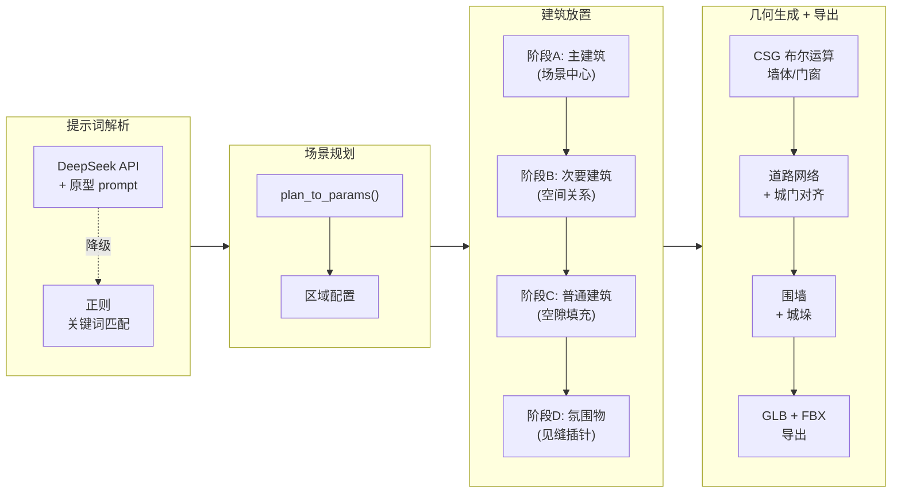
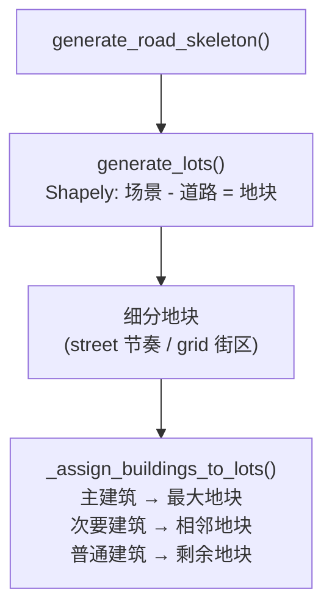
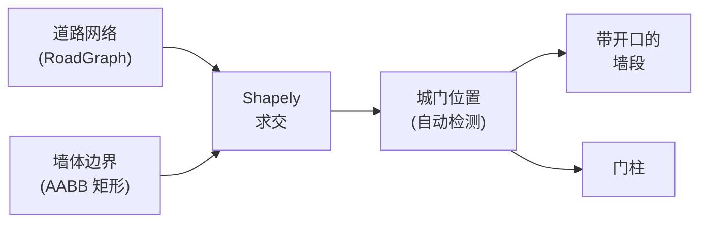

[English](README.md) | **中文**

# LevelSmith

**AI 驱动的程序化游戏关卡生成系统。**

LevelSmith 将自然语言提示词转化为完整的 3D 建筑群布局——可导出为 UE5 兼容的 FBX/GLB 格式——由多 Agent LLM 管线和训练好的神经风格模型驱动。

---

## 系统架构

系统围绕四个专业化 AI Agent 构建，每个 Agent 负责场景生成的一个方面。用户的文本提示词按顺序流经各 Agent，每个 Agent 输出结构化 JSON 供下一个 Agent（或几何引擎）消费。

<p align="center">
  
</p>

### Agent 职责分工

| Agent | 回答的问题 | 输入 | 输出 | 状态 |
|-------|-----------|------|------|------|
| **原型规划 Agent** | 放什么建筑？什么角色？什么关系？ | 用户提示词 | 建筑清单、空间关系、围合配置、氛围 | ✅ 已上线 |
| **分布规划 Agent** | 每栋建筑放在哪？什么密度？ | 建筑清单 | 坐标、区域、聚类、朝向 | ✅ 部分接入 |
| **风格与材质导演** | 长什么样？什么材质？什么老化程度？ | 场景描述 | 几何语法、材质语法、老化规则、光照 | 📄 已设计 |
| **城墙内部规划 Agent** | 城墙里有什么？巡逻道？守卫室？ | 墙段属性 | 模块、连通图、防御层 | 📄 已设计 |

---

## 提示词 → 3D 管线



---

## 建筑风格

LevelSmith 支持 20 种建筑风格，分为 7 个基础系列，每种风格映射到 23 维参数向量，控制几何形态、装饰和复杂度。

| 系列 | 基础风格 | 变体 | 代表特征 |
|------|---------|------|---------|
| 中世纪 | `medieval` | `medieval_chapel`, `medieval_keep` | 石墙、城垛、拱窗 |
| 现代 | `modern` | `modern_loft`, `modern_villa` | 平顶、大窗、简洁几何 |
| 工业 | `industrial` | `industrial_workshop`, `industrial_powerplant` | 简单几何、高 simple_ratio |
| 奇幻 | `fantasy` | `fantasy_dungeon`, `fantasy_palace` | 华丽柱子、拱门、多样屋顶 |
| 恐怖 | `horror` | `horror_asylum`, `horror_crypt` | 高密度细节、高复杂度、暗色调 |
| 日式 | `japanese` | `japanese_temple`, `japanese_machiya` | 翘檐、四坡顶、中等密度 |
| 沙漠 | `desert` | `desert_palace` | 平顶/穹顶、厚墙、少窗 |

### 23 个输出参数

| 分组 | 数量 | 参数 |
|------|------|------|
| 结构参数 | 10 | `height_range_min/max`, `wall_thickness`, `floor_thickness`, `door_width/height`, `win_width/height`, `win_density`, `subdivision` |
| 视觉参数 | 10 | `roof_type`, `roof_pitch`, `wall_color_r/g/b`, `has_battlements`, `has_arch`, `eave_overhang`, `column_count`, `window_shape` |
| 几何复杂度 | 3 | `mesh_complexity`, `detail_density`, `simple_ratio` |

---

## 布局系统

### 道路-地块架构

Street 和 grid 布局使用**基于地块的放置系统**：先生成道路，然后用 Shapely 多边形减法将场景划分为可建设地块。建筑被约束在地块内部，使道路-建筑重叠在物理上不可能发生。



Organic 和 random 布局使用不同的方法——先沿贝塞尔曲线或随机路网放置建筑，然后再生成道路连接它们。这反映了真实有机聚落的发展方式：路径是在既有建筑之间自然形成的。

### 五种布局类型

| 布局 | 道路生成 | 建筑放置 | 适用风格 |
|------|---------|---------|---------|
| `street` | 单条中央主轴 → 带节奏的地块细分 | 约束在地块内，宽度 8-18m 不等 | `modern_loft`, `japanese_machiya` |
| `grid` | 正交网格 → 街区细分 | 约束在网格街区内，每街区 ≤4 栋 | `modern`, `industrial` |
| `plaza` | 环绕中心广场的环形道路 | 阶段 A-D 角色优先放置 | `desert`, `fantasy_palace` |
| `organic` | 从中心锚点辐射的贝塞尔曲线 | 沿路采样 + 抖动 | `medieval`, `japanese`, `fantasy` |
| `random` | 随机路网骨架 | 沿路放置 + 道路重试 | `horror` 系列 |

### Street 节奏系统

真实的街道有视觉节奏——不是均匀重复。地块细分系统生成具有有意变化的地块，创造生活感和有机生长感。

| 参数 | 范围 | 目的 |
|------|------|------|
| 地块宽度 | 8–18m（每块随机） | 避免"复制粘贴"的统一外观 |
| 退距 | 1–4m（每块随机） | 有些建筑贴路，有些后退 |
| 占地比 | 0.5–0.85 | 控制建筑占地块面积的比例 |
| 氛围节点 | 每 3–5 块插入一个 | 插入井、摊位等小型元素 |
| 两侧独立 | 各自生成节奏 | 街道左右两侧绝不镜像 |

---

## 开发历程

本节记录了开发过程中遇到的关键问题、诊断方法和解决方案。这些笔记旨在帮助贡献者理解系统为何如此设计。

### 问题 1：道路系统混乱（v1 → v2 重写）

**出了什么问题。** 原始道路系统有三套互相打架的门朝向逻辑（`slot.yaw_deg`、`corridor_door_yaw` 和 `orient_doors_to_roads`），会不可预测地互相覆盖。五种布局类型各自有完全独立的道路生成逻辑，没有共享抽象。生成顺序不一致——有时先生成道路再放建筑，有时反过来。

**怎么诊断的。** 我们追踪了每一条涉及门朝向的代码路径，发现三个独立系统在写同一个字段。追踪生成顺序后发现它因布局类型而异，导致不一致的结果。

**怎么修的。** 确立了不可违反的严格生成顺序：建筑 → 道路网络 → 门朝向 → 走廊连通。引入 `RoadGraph` 数据结构作为统一接口。门朝向整合为单一信息源：道路图的接驳边方向。道路系统分为两类——规则布局（street/grid）和自由布局（plaza/random/organic）——共享接口但各有类型特定的算法。还引入了 cluster 概念，道路服务建筑群而非单栋建筑。

### 问题 2：城门与道路不对齐

**出了什么问题。** 城门硬编码在前墙中央（`z = inset`，`x = area_w / 2`），完全忽略道路实际位置。Street 模式的主干道在 `z = area_d / 2`，与城门在不同的墙面上，永远不会相交。穿过城门后——没有路。

**怎么诊断的。** 生成了诊断报告，列出每个墙体和城门函数的位置和输入。报告显示 `_make_perimeter_wall()` 对道路网络完全无感知。还发现道路 mesh 从 `x = -2` 延伸到 `x = area_w + 2`，物理上穿透了墙体。

**怎么修的。** 将城门定位从硬编码改为道路驱动。墙体生成函数现在接收道路网络，使用 Shapely 计算道路线段与墙体边界矩形的交点。城门放在交点处，宽度为 `max(道路宽度 + 2m, 6m)`。同一面墙上距离 <10m 的交点合并为一个更宽的城门。道路端点被 clamp 到墙体内侧。结果：城门与道路始终对齐，验证测试中城门中心到道路端点距离 0.00m。

### 问题 3：mesh_complexity 参数不可达

**出了什么问题。** 整合 Witcher 3 数据的三个新几何参数后，诊断发现四个问题。`build_model()` 工厂函数仍默认 `output_dim=20`。参数导出函数遗漏了三个新值。触发拱门和柱子装饰的 `mesh_complexity > 0.7` 阈值不可达——20 种风格的基准值在 0.12 到 0.64 之间。注释写"新增 10 个参数"，实际是 13 个。

**怎么修的。** 更新了 `build_model()` 默认值为 23，在导出函数中添加三个参数，将二值阈值（`> 0.7`）替换为渐进式缩放系统（`int(mesh_complexity * 4)` 控制柱子数量，`> 0.5` 触发拱门），修正了文档。

### 问题 4：Organic/random 布局感觉不自然

**出了什么问题。** 六个特定模式导致"AI 生成感"：固定采样间距产生等距排列、严格左右交替产生鱼骨对称、网格回退产生网格伪影、所有建筑同尺寸、门朝向量化为 90° 增量、中心和边缘密度无差异。

**怎么修的。** 六项修复各针对一个反模式：间距抖动（×0.7~1.3）、70/30 概率交替 + ±15° 角度抖动、网格回退替换为道路重试、建筑规模层级（anchor > sub_anchor > normal > filler）、去除 90° 量化并添加 ±8° 抖动、区域密度梯度（中心 1.0，边缘 0.6）。

### 问题 5：建筑放在道路上（archetype 模式）

**出了什么问题。** Archetype agent 管线引入后，建筑放置和道路生成之间发生了根本性解耦。原始布局函数相对于已知道路位置放置建筑，重叠不可能发生。但 `_archetype_placement()` 按角色层级放置建筑，不知道道路在哪。

**真正的洞察。** Street 和 grid 布局与 organic 和 random 布局有根本区别。在真实城市规划中，街道和网格在建筑之前规划——道路网络定义了可建设地块，建筑填充地块。有机聚落恰好相反——建筑先出现，路径在建筑之间形成。

**怎么修的。** 引入了**道路-地块系统**：street 和 grid 布局先通过 `generate_road_skeleton()` 创建道路中心线，然后 `generate_lots()` 用 Shapely 多边形减法计算可建设地块。建筑按角色优先级分配到地块中。这使道路-建筑重叠在物理上不可能——建筑存在于地块内部，而地块定义为"所有不是道路的地方"。该系统也面向未来：任何道路拓扑（T 字路口、Y 形分叉、环岛）通过相同的多边形减法产生正确的地块，无需布局特定代码。

### 问题 6：布局自动选择总是返回"street"

**出了什么问题。** 用户选择"Auto"布局时，无论风格或提示词内容如何，系统一律默认 street 布局。

**怎么修的。** 创建了 `_STYLE_DEFAULT_LAYOUT` 映射表（medieval→organic, modern→grid, horror→random, desert→plaza），三级 fallback 的默认值从 "street" 改为根据风格选择或 "organic"。

### 问题 7：Archetype agent 从未执行

**出了什么问题。** 部署 archetype agent 管线后，sidebar 不显示 archetype plan，API 返回 `archetype_plan: null`。

**怎么修的。** 通过浏览器拦截 fetch 响应确认 API 返回 null，服务端添加诊断 print 后发现第一行就检查 `DEEPSEEK_API_KEY`，key 缺失直接走 regex 降级。添加了 `python-dotenv` 支持从 `.env` 文件加载 key。

---

## 围墙与城门系统



| 特性 | 描述 |
|------|------|
| 城门检测 | 通过 Shapely `LineString` 计算道路与墙体交点 |
| 城门合并 | 同一面墙上 <10m 的城门合并为一个 |
| 道路 clamp | 道路端点 clamp 到墙体内侧 |
| 围合覆盖 | Archetype agent 可设置 `walled` / `partial` / `open` |
| 墙体风格 | 9 种风格启用围墙（medieval/fantasy/horror 系列） |

---

## 训练数据

| 数据源 | 记录数 | 用途 |
|--------|-------|------|
| 合成数据 | 131,020 | 风格参数生成（20 种风格） |
| OSM 真实建筑 | ~60,000 | 微调（卡尔卡松/布鲁日/约克/京都） |
| Witcher 3 布局 | 11,903 | 建筑布局模式 |
| Witcher 3 Mesh | 1,856 | Mesh 复杂度统计 |
| 布局模型数据 | 34,266 | OSM 22,363 + W3 11,903 栋建筑 |

### 模型性能

| 指标 | 数值 |
|------|------|
| 架构 | MLP 16 → 128 → 64 → 32 → 23 |
| 最佳 val_loss | 0.00189 |
| 最终 val_MAE | 0.031 |
| 可训练参数数 | 13,719 |

---

## Web 界面

| 组件 | 技术 |
|------|------|
| 后端 | FastAPI (`api.py`) |
| 前端 | 原生 JS + Three.js 0.160.0 |
| 3D 预览 | GLTFLoader + OrbitControls |
| LLM 集成 | DeepSeek API（OpenAI 兼容格式） |
| 导出格式 | GLB + FBX（UE5 兼容） |

### API 端点

| 路由 | 方法 | 描述 |
|------|------|------|
| `/` | GET | 提供 Web 界面 |
| `/generate` | POST | 解析提示词，执行生成 |
| `/download/{filename}` | GET | 提供生成的文件下载 |
| `/styles` | GET | 返回可用风格和布局列表 |

---

## 快速开始

### 前置条件

- **Python 3.10+**（已在 3.11 上测试）
- **操作系统**: Windows 10/11, Linux, macOS
- **GPU**（可选）: CUDA 兼容 GPU 用于训练；生成可在 CPU 上运行

### 第一步 — 克隆与安装

```bash
git clone https://github.com/Leery-89/LevelSmith.git
cd LevelSmith

# 创建虚拟环境（推荐）
python -m venv .venv
# Windows
.venv\Scripts\activate
# Linux / macOS
source .venv/bin/activate

# 安装依赖
cd training
pip install -r requirements.txt
```

> **PyTorch 注意事项**: 默认 `pip install` 可能安装 CPU 版本的 PyTorch。如需 GPU 加速，请先访问 [pytorch.org](https://pytorch.org/get-started/locally/) 获取对应平台的安装命令。

### 第二步 — 配置 LLM（可选）

在 `training/` 目录创建 `.env` 文件：

```bash
echo "DEEPSEEK_API_KEY=sk-你的key" > .env
```

| 有 API key | 无 API key |
|---|---|
| 完整 archetype agent（建筑角色、空间关系、氛围） | 正则关键词匹配（功能仍可用） |
| 丰富的多建筑场景规划 | 基础风格 + 布局检测 |

没有 API key 时，所有几何、布局和导出功能仍然正常工作。

### 第三步 — 启动 Web 界面

```bash
# 在 training/ 目录下
python -m uvicorn api:app --host 0.0.0.0 --port 8000
```

在浏览器中打开 `http://localhost:8000`，输入提示词并点击 **Generate**。

### 第四步 — 试试这些提示词

| 提示词 | 预期结果 |
|--------|---------|
| `medieval village with church and market` | Organic 布局，8-12 栋建筑，石墙，拱窗 |
| `japanese temple complex` | Organic 布局，翘檐，四坡顶，庭院感 |
| `modern city block` | Grid 布局，平顶，大窗，简洁几何 |
| `desert palace with walls` | Plaza 布局，穹顶，厚墙，带城门围墙 |
| `horror asylum` | Random 布局，高密度细节，暗色调 |
| `industrial factory district` | Grid 布局，简单几何，高 simple_ratio |

### 命令行生成

```python
# 在 training/ 目录下运行
from level_layout import generate_level

# 基本用法
scene = generate_level(style="medieval_keep", layout_type="organic",
                       building_count=10, seed=42)
scene.export("output.glb")

# 自定义区域大小
scene = generate_level(style="japanese_temple", layout_type="plaza",
                       building_count=6, area_size=80.0, seed=123)
scene.export("temple_complex.glb")
```

`generate_level()` 参数说明：

| 参数 | 默认值 | 描述 |
|------|--------|------|
| `style` | （必填） | 20 种风格之一（如 `medieval`, `japanese_temple`） |
| `layout_type` | `"street"` | `street` / `grid` / `plaza` / `organic` / `random` |
| `building_count` | `10` | 生成建筑数量 |
| `area_size` | `100.0` | 场景区域大小（米，正方形） |
| `variation` | `0.4` | 风格变化量（0.0 = 完全基准，1.0 = 最大变化） |
| `seed` | `42` | 随机种子，用于复现 |

### 查看生成文件

- **Web UI**: 内置 3D 预览（Three.js）
- **桌面**: 用 [Blender](https://www.blender.org/)、Windows 3D 查看器或任意 glTF 查看器打开 `.glb` 文件
- **UE5**: 导入 `.glb` 或用 `python glb_to_fbx.py` 转换为 `.fbx`

### 运行测试

```bash
cd training
python -m pytest tests/ -v
```

常见问题请参阅 [TROUBLESHOOTING.md](training/TROUBLESHOOTING.md)。

---

## 路线图

### 已完成 (v0.2)

| 特性 | 详情 |
|------|------|
| ✅ 23 参数风格模型 | 10 结构 + 10 视觉 + 3 几何复杂度 |
| ✅ Archetype agent 管线 | DeepSeek LLM → JSON plan → 分阶段放置 |
| ✅ 道路-地块系统 | Shapely 多边形减法、street 节奏、grid 街区 |
| ✅ 5 种布局算法 | street, grid, plaza, organic, random |
| ✅ 城门-道路对齐 | Shapely 交点计算、自动城门检测 |
| ✅ Organic/random 优化 | 6 项自然感增强 |
| ✅ 按建筑混合风格 | 每栋建筑可用不同 style_key |
| ✅ Web 界面 | FastAPI + Three.js + sidebar archetype 展示 |

### 计划中 (v1.0)

| 特性 | 描述 |
|------|------|
| 风格与材质导演 | LLM 驱动的视觉规则（几何语法、老化、光照） |
| 城墙内部结构 | 巡逻道、守卫室、楼梯系统 |
| 凯尔莫汉原型 | 完整的中世纪要塞 archetype + W3 精确布局 |
| 模型训练 v2 | 规则底座 + 学习偏移、两层监督 |
| 检索拼装 | Poly Haven 素材库 + CLIP 检索 |

---

## 参考论文

| 论文 | 发表 | 核心思想 |
|------|------|---------|
| Infinigen | CVPR 2023 | 程序化 3D 场景生成 |
| CityDreamer | CVPR 2024 | 无界 3D 城市生成 |
| CityCraft | 2024 | LLM 驱动的城市布局 |
| Proc-GS | 2024 | 程序化 3D 高斯泼溅 |

---

## 硬件

| 组件 | 用途 |
|------|------|
| RTX 4070 Laptop | 训练 (CUDA) |
| AMD XDNA 2 NPU | 推理（实验性） |
| CPU | 推理降级 |
